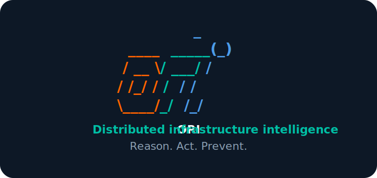

<p align="center">
  
</p>

`ori-cli` is the operator control surface for deployed
[`ori-runtime`](https://github.com/ori-platform/ori-runtime) devices. It helps an
installer or operator validate runtime posture, inspect live health, manage
skills, and handle deployment/token workflows without reimplementing runtime
safety semantics in Go.

```text
config validate          check runtime posture
doctor runtime-health    inspect a running device
skills list              see installed Ori skills
```

The CLI follows contracts from
[`ori-specs`](https://github.com/ori-platform/ori-specs). Runtime-owned behavior
delegates through the runtime bridge; the CLI does not parse `ori.yaml`,
validate skills, or inspect runtime state independently.

## Current Surface

- Go binary with Cobra-based command tree and no Python embedding.
- Command tree matching [`ori-specs/cli-commands/v1`](https://github.com/ori-platform/ori-specs/blob/main/cli-commands/v1.md).
- Runtime health socket client boundary for `ori doctor runtime-health`.
- Runtime bridge subprocess boundary for config and skill delegation.
- Authenticated runtime socket client for firmware MQTT transport-identity
  provisioning.
- Cloud client boundary for token/deploy commands.
- Offline token-use invariant test: no network call path.
- CI, shell hygiene checks, license headers, and contribution guardrails.
- Branded first-run terminal welcome that respects `NO_COLOR`, JSON output, CI,
  and noninteractive shells.

## Deferred Work

- SQLite state queries.
- Skills Hub install flow.
- ori-cloud token/deploy endpoints.
- Physical-device delivery and HIL provisioning proof.

## Firmware MQTT Transport Identity

`ori firmware mqtt` drives the runtime-owned provisioning workflow. The CLI is
only an authenticated operator client: it does not sign firmware messages,
issue certificates, allocate provisioning sequences, inspect runtime storage,
or handle issuer and device private keys.

The operator flow is:

```text
create-csr
  -> deliver the signed request to the device
  -> prepare-install with the device CSR response
  -> deliver the signed install request to the device
  -> verify-install-result with the device result
```

Revocation uses `revoke` followed by `verify-revoke-result`. Public status uses
`status` followed by `verify-status-response`. Each follow-up supplies the
runtime-issued correlation ID and the canonical base64 device response. The
runtime derives the audit actor from the authenticated Unix peer; the CLI has
no `actor` option.

Use `--output json` for the complete typed runtime envelope. A command exits
nonzero for runtime errors, authenticated refusals, and install or revoke
results whose verdict is not exactly `accepted`.

MQTT client identity is transport defence in depth. It does not grant Layer 1
evidence trust or Tier B/C/D action authority. Real-device delivery and HIL
proof remain firmware bench work.

## Development

```bash
bash scripts/check_workflows.sh
bash scripts/check_hygiene.sh
go test ./...
go build ./...
```

Preview the first-run welcome locally:

```bash
rm -f ~/.local/state/ori-cli/welcome-v1
go run .
```

## CGO Note

Future SQLite state commands may use `go-sqlite3`, which requires CGO and a C
compiler. The bootstrap intentionally has no CGO dependency until state query
implementation starts.
